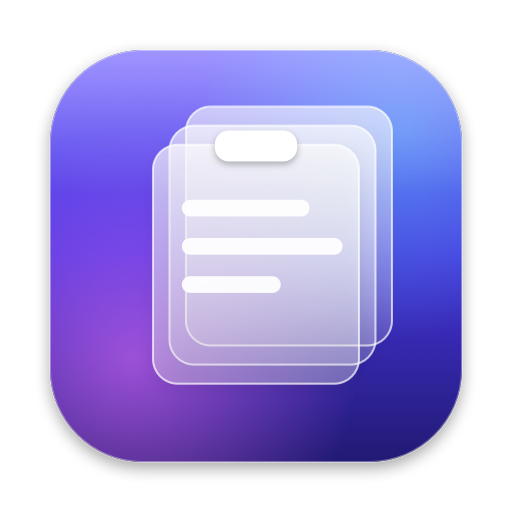

<div align="center">



# Vault

**Your clipboard, remembered.**

A Liquid Glass clipboard manager for macOS. Everything you copy, one <kbd>⇧</kbd><kbd>⌘</kbd><kbd>V</kbd> away.

[](https://www.apple.com/macos/)
[](https://swift.org)
[](https://developer.apple.com/documentation/swiftui)
[](LICENSE)
[](PRIVACY.md)

[Features](#features) · [Editions](#two-editions) · [Install](#install) · [Shortcuts](#keyboard-shortcuts) · [Build](#build-from-source) · [Privacy](#privacy)

</div>

---

## Why Vault

macOS remembers exactly one thing you copied. Vault remembers all of them: the link from this morning, the paragraph you overwrote, the colour from last week's mock-up. Press <kbd>⇧</kbd><kbd>⌘</kbd><kbd>V</kbd>, type a word, press <kbd>↩</kbd>. It lives in your menu bar, opens instantly, and never sends a byte off your Mac.

## Features

| | |
|---|---|
| **One shortcut, anywhere** | <kbd>⇧</kbd><kbd>⌘</kbd><kbd>V</kbd> opens a floating glass panel over whatever you are doing. Change the shortcut in Settings. |
| **Search as you type** | Every word you type narrows the list, across text, links, file names and the app it came from. |
| **Knows what you copied** | Text, links, images, files and colours each get their own preview. Code is shown in a monospaced font. |
| **Colours, decoded** | Copy `#5E5CE6`, `rgb()` or `hsl()` and Vault shows a swatch, ready to re-copy as HEX, RGB or HSL. |
| **Pin what matters** | Pinned clips sit on top and are never deleted. |
| **You decide how long** | Keep history for an hour, a day, a week, a month, three months, a year or forever, with a cap on the number of clips. |
| **Private by default** | Skips passwords and one-time codes from password managers, ignores apps you choose, and pauses on request. |
| **Fully keyboard-driven** | Arrows to move, <kbd>⌘</kbd><kbd>1</kbd> to <kbd>⌘</kbd><kbd>9</kbd> to pick, <kbd>⇥</kbd> to filter, <kbd>⎋</kbd> to close. |
| **Native through and through** | SwiftUI with Liquid Glass, SF Symbols, light and dark mode, and no Electron or web views. |

## Two editions

Vault is one codebase built two ways.

| | **Vault** | **Vault Direct** |
|---|---|---|
| Where to get it | Mac App Store | Direct download |
| Choosing a clip | Copies it, you press <kbd>⌘</kbd><kbd>V</kbd> | Pastes it where you are typing |
| Permissions | None | Accessibility, granted with a drag through [PermissionFlow](https://github.com/jaywcjlove/PermissionFlow) |
| App Sandbox | Yes | No |

The App Store edition is sandboxed and asks for nothing. Vault Direct can press <kbd>⌘</kbd><kbd>V</kbd> for you, which the App Store does not allow for clipboard managers.

## Install

**Mac App Store:** coming soon.

**From source:** see [Build from source](#build-from-source). Requires macOS 26 Tahoe or later.

## Keyboard shortcuts

| Keys | In the panel |
|---|---|
| <kbd>↩</kbd> | Paste (Vault Direct) or copy (Vault) the selected clip |
| <kbd>⇧</kbd><kbd>↩</kbd> | The same, as plain text |
| <kbd>⌘</kbd><kbd>1</kbd> to <kbd>⌘</kbd><kbd>9</kbd> | Choose that clip |
| <kbd>↑</kbd> <kbd>↓</kbd> | Move the selection (<kbd>⌘</kbd> jumps to the ends) |
| <kbd>⇥</kbd> / <kbd>⇧</kbd><kbd>⇥</kbd> | Next or previous filter |
| <kbd>⌘</kbd><kbd>P</kbd> | Pin or unpin |
| <kbd>⌘</kbd><kbd>O</kbd> | Open the link, show the file, or open the image |
| <kbd>⌘</kbd><kbd>⌫</kbd> | Delete |
| <kbd>⎋</kbd> | Clear the search, then close |

## Build from source

You need Xcode 26 or later and [XcodeGen](https://github.com/yonaskolb/XcodeGen).

```bash
brew install xcodegen
git clone https://github.com/anaygoenka/vault.git
cd vault
xcodegen generate
open Vault.xcodeproj
```

Pick the **Vault** or **Vault Direct** scheme, set your own team under *Signing & Capabilities*, and run. From the command line:

```bash
xcodebuild -project Vault.xcodeproj -scheme "Vault Direct" -configuration Release DEVELOPMENT_TEAM=YOURTEAMID build
```

`Scripts/install.sh` runs the tests, builds Vault Direct in Release and installs it to `/Applications`. Pass `appstore` to install the App Store edition instead.

## How it works

```
Vault/
├── App/          Entry point, menu bar, windows, edition switches
├── Model/        ClipItem, Retention, colour parsing
├── Services/     Clipboard monitor, history store, hotkey, paste, permissions
└── UI/           Panel, preview, Settings and onboarding
```

- **Clipboard monitor:** macOS has no clipboard notification, so Vault reads the pasteboard's change count a few times a second. It is a single integer read.
- **History store:** an in-memory list saved as JSON, with images and rich text stored beside it. Saves are debounced and run off the main thread.
- **The panel:** a non-activating `NSPanel`, so the app you were typing in keeps focus and the paste lands back in it.
- **Global shortcut:** Carbon's `RegisterEventHotKey`, which needs no permission.

## Privacy

Vault has no accounts, no analytics and no network access. History stays on your Mac, and deleting Vault deletes it. Read the full [privacy policy](PRIVACY.md).

## Contributing

Issues and pull requests are welcome. Read [CONTRIBUTING.md](CONTRIBUTING.md) first.

## Licence

[MIT](LICENSE) © 2026 Anay Goenka
